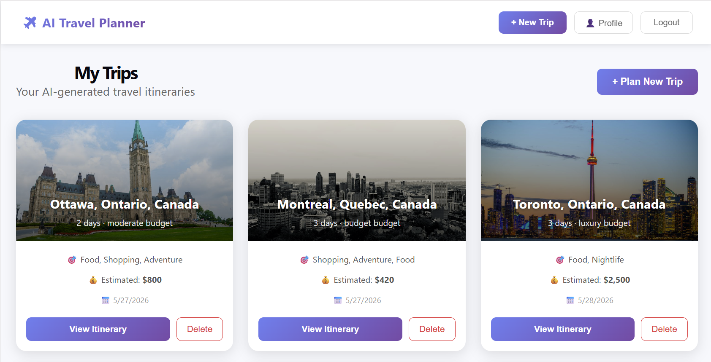
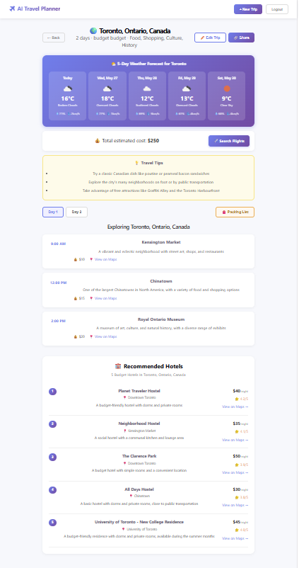
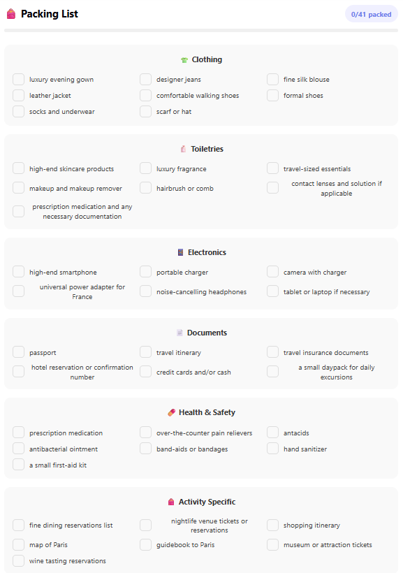

# ✈️ AI Travel Planner

> A full-stack AI-powered travel planning web app that generates personalized day-by-day itineraries, hotel recommendations, packing lists, and real-time weather forecasts for any destination in the world.

## 🌐 Live Demo

[Live App](https://ai-travel-planner-zeta-one.vercel.app) 

Backend API: https://ai-travel-planner-4wuo.onrender.com

---

## 📸 Screenshots

| Dashboard | Trip Itinerary | Packing List |
|-----------|---------------|--------------|
|  |  |  |

---

## ✨ Features

| Feature | Description |
|---------|-------------|
| 🤖 **AI Itinerary Generation** | Day-by-day travel plans with places, times and estimated costs powered by Groq AI (LLaMA 3.3) |
| 🏨 **Hotel Recommendations** | 5 curated hotels matched to your budget — budget, moderate or luxury |
| 🌤️ **5-Day Weather Forecast** | Real-time weather forecast for your destination via OpenWeatherMap |
| 🎒 **AI Packing List** | Smart packing checklist with categories, checkboxes and progress tracking |
| ✈️ **Flight Search** | One-click Google Flights search for your destination |
| 🗺️ **Google Maps Integration** | Every place and hotel links directly to Google Maps |
| 🔗 **Share Trips** | Share your itinerary via a public link — no login required for viewers |
| ✏️ **Edit & Regenerate** | Change days, budget or interests and regenerate with one click |
| 📍 **City Autocomplete** | Smart city search powered by OpenStreetMap to avoid city name confusion |
| 🖼️ **Destination Photos** | Beautiful city photos on every trip card via Pexels API |
| 🔐 **User Authentication** | Secure register/login with JWT tokens and bcrypt password hashing |

---

## 🛠️ Tech Stack

### Frontend
| Technology | Purpose |
|-----------|---------|
| React + Vite | Fast modern frontend framework |
| React Router | Client-side routing with protected routes |
| Axios | HTTP client with JWT interceptors |
| OpenStreetMap Nominatim | City autocomplete search |
| Pexels API | Destination background photos |
| OpenWeatherMap API | 5-day weather forecast |
| Vercel | Frontend deployment |

### Backend
| Technology | Purpose |
|-----------|---------|
| FastAPI | High-performance Python REST API |
| SQLAlchemy | ORM for database management |
| PostgreSQL (Neon) | Cloud database for persistent storage |
| JWT + bcrypt | Secure authentication |
| Groq AI (LLaMA 3.3) | AI itinerary and packing list generation |
| Render | Backend deployment |

---

## 🚀 Getting Started Locally

### Prerequisites
- Python 3.10+
- Node.js 18+
- PostgreSQL database (Neon free tier recommended)
- Groq API key (free at console.groq.com)
- Pexels API key (free at pexels.com/api)
- OpenWeatherMap API key (free at openweathermap.org)

### Backend Setup

```bash
# Clone the repo
git clone https://github.com/PaakhiKataria/ai-travel-planner.git
cd ai-travel-planner/backend

# Create and activate virtual environment
python -m venv venv
venv\Scripts\activate        # Windows
source venv/bin/activate     # Mac/Linux

# Install dependencies
pip install -r requirements.txt
```

Create a `.env` file in the `backend` folder:

```env
DATABASE_URL=your_neon_postgresql_url
SECRET_KEY=your_secret_key
ALGORITHM=HS256
ACCESS_TOKEN_EXPIRE_MINUTES=30
GROQ_API_KEY=your_groq_api_key
```

Run the backend:

```bash
uvicorn main:app --reload
```

Backend runs at `http://localhost:8000`
API docs available at `http://localhost:8000/docs`

### Frontend Setup

```bash
cd ../frontend
npm install
```

Create a `.env` file in the `frontend` folder:

```env
VITE_PEXELS_API_KEY=your_pexels_key
VITE_WEATHER_API_KEY=your_openweathermap_key
```

Run the frontend:

```bash
npm run dev
```

Frontend runs at `http://localhost:5173`

---

## 📡 API Endpoints

### Authentication
| Method | Endpoint | Description |
|--------|----------|-------------|
| POST | `/auth/register` | Register a new user |
| POST | `/auth/login` | Login and receive JWT token |

### Trips
| Method | Endpoint | Description | Auth |
|--------|----------|-------------|------|
| POST | `/trips/generate` | Generate AI itinerary | ✅ |
| GET | `/trips/` | Get all trips for current user | ✅ |
| GET | `/trips/{id}` | Get single trip | ✅ |
| PUT | `/trips/{id}/regenerate` | Regenerate with new settings | ✅ |
| POST | `/trips/{id}/packing-list` | Generate AI packing list | ✅ |
| GET | `/trips/share/{token}` | Get shared trip (public) | ❌ |
| DELETE | `/trips/{id}` | Delete a trip | ✅ |

---

## 📁 Project Structure

```
ai-travel-planner/
├── backend/
│   ├── routes/
│   │   ├── auth.py           # Register & login endpoints
│   │   └── trips.py          # Trip CRUD + AI generation
│   ├── database.py           # SQLAlchemy database connection
│   ├── models.py             # User & Trip database models
│   ├── schemas.py            # Pydantic request/response schemas
│   ├── auth_utils.py         # JWT creation & verification
│   ├── main.py               # FastAPI app + CORS config
│   └── requirements.txt      # Python dependencies
│
└── frontend/
    └── src/
        ├── api/
        │   └── axios.js      # Axios instance + JWT interceptors
        ├── components/
        │   ├── Navbar.jsx     # Top navigation bar
        │   └── TripCard.jsx   # Dashboard trip card with photo
        └── pages/
            ├── Login.jsx      # Login page
            ├── Register.jsx   # Register page
            ├── Dashboard.jsx  # All trips view
            ├── CreateTrip.jsx # New trip form with city search
            ├── TripDetail.jsx # Full itinerary view
            └── ShareTrip.jsx  # Public shared trip view
```

---

## 🔑 Environment Variables

### Backend (`backend/.env`)
| Variable | Description |
|----------|-------------|
| `DATABASE_URL` | Neon PostgreSQL connection string |
| `SECRET_KEY` | JWT signing secret |
| `ALGORITHM` | JWT algorithm (HS256) |
| `ACCESS_TOKEN_EXPIRE_MINUTES` | Token expiry duration |
| `GROQ_API_KEY` | Groq AI API key |

### Frontend (`frontend/.env`)
| Variable | Description |
|----------|-------------|
| `VITE_PEXELS_API_KEY` | Pexels API key for destination photos |
| `VITE_WEATHER_API_KEY` | OpenWeatherMap API key for weather |

---

## 🚢 Deployment

### Backend — Render
- **Runtime:** Python 3
- **Root Directory:** `backend`
- **Build Command:** `pip install -r requirements.txt`
- **Start Command:** `uvicorn main:app --host 0.0.0.0 --port $PORT`

### Frontend — Vercel
- **Framework:** Vite
- **Root Directory:** `frontend`
- **Add `vercel.json`** for React Router support:

```json
{
  "rewrites": [{ "source": "/(.*)", "destination": "/" }]
}
```

---

## 👩‍💻 Author

**Paakhi Kataria**
- GitHub: [@PaakhiKataria](https://github.com/PaakhiKataria)

---

## 📄 License

This project is licensed under the MIT License.